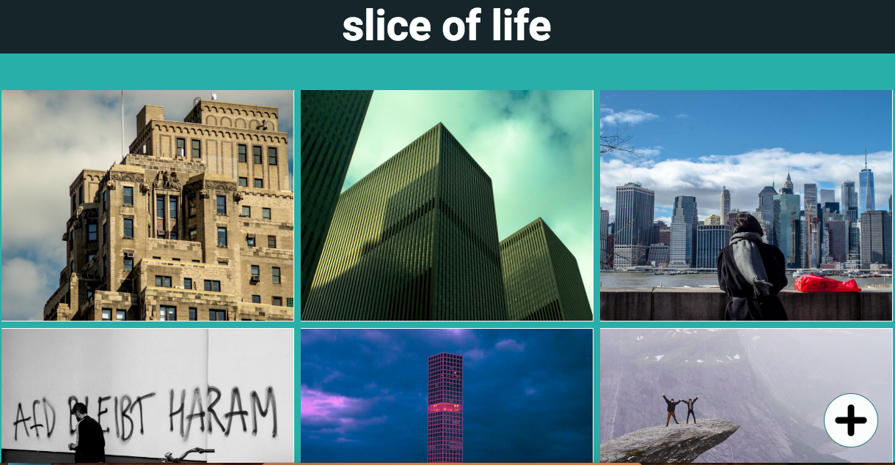
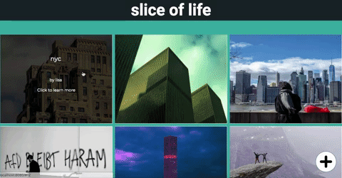
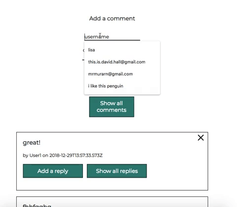
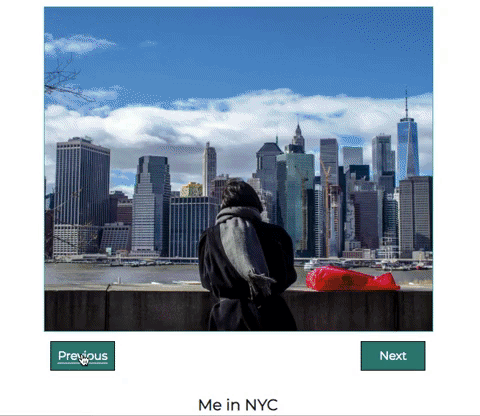

# Slice of life: image board for  snapshots of the daily life

Tech stack
-------- 
- Vue.js
- Node.js
- Express.js
- AWS S3 (for hosting the images)
- PostgreSQL

Overview
--------
#### Short description 
Slice of Life Image Board is an Instagram-style full stack single page application that allows users to upload pictures to a general board, as well as comment on other people's pictures and reply to others' comments. Built as a student project for Spiced Academy in 5 days.

#### Walkthrough
The landing page shows the full gallery of images posted by all the users. 

  

On the bottom of the page there is a "more" button which loads the next set of images and disappears in case there are no more images to show.

The user can also upload their own picture by clicking on the plus button in the bottom right corber. The user will need to enter their name, the title and the description of the picture. The picture will be added to the gallery and shown on the top.

When not in use, the uploader remains hidden.

When hovering on the image its title and short description are shown. When clicking on the image a pop-up with a bigger version of the image, all relevant information and the comments is shown.

  

One can also add comments and replies to comments.

  

Moreover, there are "previous" and "next" buttons which allow to browse the pictures.

  

Future Features
----------
- fix empty reply bug